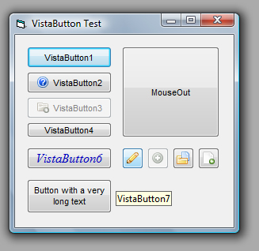



## VistaButton

### Description

UserControl that provides a Windows-Vista-Button.
 
### More Info
 

             |
---                |---
**Submitted On**   |2012-02-20 22:07:12
**By**             |[BobbySteels](https://github.com/Planet-Source-Code/PSCIndex/blob/master/ByAuthor/bobbysteels.md)
**Level**          |Advanced
**User Rating**    |5.0 (10 globes from 2 users)
**Compatibility**  |VB 6\.0
**Category**       |[Custom Controls/ Forms/  Menus](https://github.com/Planet-Source-Code/PSCIndex/blob/master/ByCategory/custom-controls-forms-menus__1-4.md)
**World**          |[Visual Basic](https://github.com/Planet-Source-Code/PSCIndex/blob/master/ByWorld/visual-basic.md)
**Archive File**   |[VistaButto2222103272012\.zip](https://github.com/Planet-Source-Code/bobbysteels-vistabutton__1-74274/archive/master.zip)

